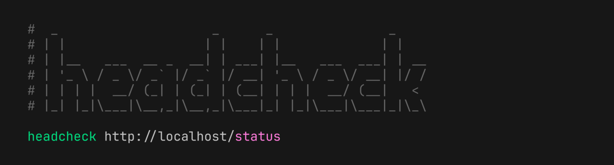

<!-- This is free and unencumbered software released into the public domain. -->



<div style='display: flex; justify-content: space-between; max-width: 1280px'>
	
	
	
</div>
<br>

Headcheck is a CLI program which performs a `HEAD` request to a given URL. It returns `0` if the
request was successful or `1` if it was not.

Headcheck is small, simple, statically compiled and feature complete. It intentionally does not
support any features other than the bare minimum. If you need something more powerful then headcheck
is a poor choice.

# Motivation

Headcheck provides a way to add Docker/Podman healthcheck support to scratch containers without
substantially increasing their size or attack surface.

# Usage

There are very few ways to (mis)use headcheck:

| Command                         | Standard Output                           | Exit Code |
| ------------------------------- | ----------------------------------------- | --------- |
| `headcheck http://no.content`   | success: 204                              | 0         |
| `headcheck http://bad.gateway`  | failure: 502                              | 1         |
| `headcheck http://unknown.host` | error: UnknownHostName                    | 1         |
| `headcheck missing.scheme`      | unparseable: missing.scheme               | 2         |
| `headcheck --help`              | docs: https://pixelatedlabs.com/headcheck | 0         |
| `headcheck --version`           | version: 1.2.3                            | 0         |
| `headcheck invalid arguments`   | usage: headcheck &lt;url&gt;              | 2         |
| `headcheck`                     | usage: headcheck &lt;url&gt;              | 2         |

# Example

A condensed example of including the latest release of headcheck in a scratch container. This uses a
multi-stage build to perform the download and copies the result into the final image.

```dockerfile
FROM alpine AS headcheck
RUN wget https://pixelatedlabs.com/headcheck/releases/linux_x64.zip
RUN unzip /linux_x64.zip

FROM scratch
COPY --from=headcheck /headcheck /usr/bin/headcheck
HEALTHCHECK CMD ["/usr/bin/headcheck", "http://localhost:8080"]
```

# Quirks

Useful things to know when running headcheck:

- A successful response is defined as having a status matching `>= 200 AND < 300`
- Headcheck can not follow redirects - they are considered to be failures
- URLs must be fully formed - this ensures that the chosen scheme is explicit

```ruby
# Valid
http://localhost:8080
https://example.com/foo/bar?baz

# Invalid
localhost:8080
example.com/foo/bar?baz
```

# Contributing

Contributions are welcome! However, please note that headcheck has an intentionally limited scope
and is considered primarily feature complete. If you're unsure whether a PR is a good fit please
open an issue first to discuss it.

# License

This is free and unencumbered software released into the public domain.
